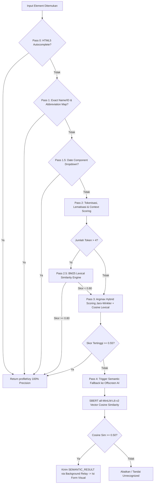
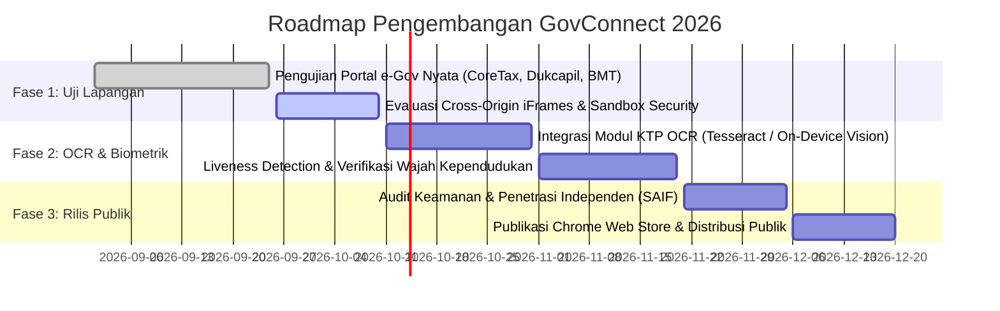

# GovConnect Chrome Extension — System Context & Architectural State Progress
**Document Version:** 2.1.0  
**Target Environment:** Chromium Extensions Manifest V3 (MV3)  
**Security Standard:** Strict Content Security Policy (CSP), Origin Isolation (COOP/COEP)  
**Classification:** Academic & Enterprise Architecture Specification  
**Last Updated:** September 2026  

---

## 1. Executive Summary & Purpose

Dokumen ini berfungsi sebagai **System Context permanen dan sumber kebenaran teknis (*single source of truth*)** bagi seluruh pengembang manusia maupun agen AI (*AI Assistant*) di masa depan. Dokumen ini merangkum topologi arsitektural, alur data *end-to-end*, terobosan teknis dalam mengatasi batasan ketat Manifest V3, serta status integrasi sistem autofill formulir cerdas **GovConnect**.

Setiap agen AI atau pengembang yang melanjutkan proyek ini **WAJIB membaca dan mematuhi batasan arsitektur** yang telah dipecahkan di dalam dokumen ini (terutama pada Bagian 3).

---

## 2. Architecture & File Hierarchy

GovConnect menerapkan arsitektur modular yang memisahkan tanggung jawab antara antarmuka pengguna (*DOM Layer*), orkestrasi perizinan (*Service Worker Layer*), dan komputasi inferensi kecerdasan buatan (*Offscreen Computing Layer*).

### 2.1 Peta Struktur File Proyek

```text
govconnect/
├── backend/                             # REST API Backend (FastAPI, PostgreSQL, SQLAlchemy)
│   ├── app/
│   │   ├── api/routers/                 # auth_router, profile_router, activity_router, mapping_router
│   │   ├── core/                        # config.py, security.py (JWT, Hashing)
│   │   ├── models/entities.py           # User, Profile, ActivityLog, FormMapping
│   │   ├── schemas/schemas.py           # Pydantic v2 schemas
│   │   └── services/                    # Profile & Activity business logic
│   └── tests/                           # Pytest integration & unit test suite
├── docs/                                # PRD, Design System, User Flow, LaTeX Academic Paper
├── extension/                           # Chrome Extension Core (Manifest V3)
│   ├── manifest.json                    # MV3 Configuration, CSP directives, host_permissions
│   ├── background.js                    # Service Worker: Lifecycle, tab relay, token sync, 1-Click
│   ├── content_script.js                # DOM Engine: Shadow DOM, Cascade Matching, MutationObserver
│   ├── offscreen.html                   # Offscreen Document host (type="module")
│   ├── offscreen.js                     # AI Inferencing: Transformers.js, SBERT, Cosine Similarity
│   ├── popup.html / popup.js            # Quick action popup (fallback UI)
│   ├── sidepanel.html / sidepanel.js    # Primary Extension UI: Field review, manual mapping, sync
│   └── lib/                             # Local bundled libraries (zero-remote-code execution)
│       ├── transformers.js              # ESM Bundled @xenova/transformers (CSP & eval-free patched)
│       ├── ort-wasm.wasm                # ONNX Runtime WebAssembly baseline binary
│       ├── ort-wasm-simd.wasm           # ONNX Runtime SIMD accelerated WebAssembly binary
│       ├── ort-wasm-threaded.wasm       # ONNX Runtime Threaded WebAssembly binary
│       └── ort-wasm-simd-threaded.wasm  # ONNX Runtime SIMD Threaded WebAssembly binary
├── frontend/                            # Web Management Dashboard (React 18, Vite, Tailwind CSS)
│   └── src/pages/                       # Dashboard, Profile, Activity, Settings, Auth
├── test-form.html                       # Integration Testbed: Obfuscated IDs, BM25, Burst DOM, Shadow DOM, SBERT
└── test-page/                           # Standard legacy test forms (RoboForm, DemoQA)
```

### 2.2 Pembagian Tanggung Jawab Komponen Ekstensi

| Komponen | Ekosistem | Tanggung Jawab Utama |
|---|---|---|
| **`content_script.js`** | DOM Tab Pengguna | 1. Menembus batas DOM & Shadow DOM secara rekursif.<br>2. Ekstraksi label, ID, name, atribut aria, placeholder, dan parent context.<br>3. Menjalankan *Fast Matching Cascade* (Autocomplete W3C, Lexical Prefix, Jaro-Winkler, BM25).<br>4. Memantau mutasi formulir dinamis via debounced `MutationObserver`.<br>5. Mencegah pesan berulang menggunakan Set `pendingSemanticRequests`.<br>6. Menjalankan injeksi nilai visual ke elemen input/select/custom component. |
| **`background.js`** | Background Service Worker | 1. Mengelola *lifecycle* ekstensi dan *event listener* toolbar browser.<br>2. Memastikan pembuatan dan pemeliharaan dokumen offscreen (`setupOffscreenDocument`).<br>3. Bertindak sebagai *Message Broker* antara Content Script dan Offscreen Document.<br>4. Menyinkronkan token otentikasi dari tab web dashboard terbuka.<br>5. Mencatat telemetri dan log aktivitas autofill ke backend FastAPI (`POST /api/v1/activities`). |
| **`offscreen.js`** | Offscreen Document (DOM Tersembunyi) | 1. Mengisolasi pemuatan model AI berat agar tidak memblokir UI thread maupun service worker.<br>2. Menginisiasi model quantized SBERT (`all-MiniLM-L6-v2`) via Singleton.<br>3. Menerima request `SEMANTIC_FALLBACK` untuk label yang gagal dievaluasi secara leksikal.<br>4. Menghitung embedding tensor 384 dimensi dan membandingkannya menggunakan *Cosine Similarity* terhadap kamus semantik.<br>5. Mengirimkan event `SEMANTIC_RESULT` kembali ke background worker. |

---

## 3. Core Logic Pipeline: Hybrid Cascade Mapping

GovConnect memecahkan tantangan klasifikasi formulir heterogen (dari formulir legacy era 2000-an, formulir modern CoreTax/PrimeNG, hingga portal SPA kompleks) menggunakan arsitektur **Hybrid Cascade Pipeline**.



### 3.1 Rincian Tahapan Cascade:
1. **Pass 0 — Standar W3C Autocomplete:** Membaca atribut `autocomplete` (misal: `given-name`, `postal-code`, `tel`, `bday`). Memberikan kepastian 100% tanpa komputasi tambahan.
2. **Pass 1 — Exact Match, Numeric Prefix Stripper & Abbreviation Expansion:**
   - Membersihkan prefiks teknis numerik (misal: `02frstname` $\rightarrow$ `frstname`).
   - Menerjemahkan singkatan warisan SAP/RoboForm via `ABBREVIATION_MAP` (misal: `cellphon` $\rightarrow$ `phone`, `pers_ssn` $\rightarrow$ `nik`, `birth_pl` $\rightarrow$ `birth_place`).
3. **Pass 1.5 — Sub-komponen Tanggal Dropdown:** Mendeteksi elemen `<select>` yang merepresentasikan hari (`dd`), bulan (`mm`), atau tahun (`yyyy`) berdasarkan rentang nilai numerik (1-31, 1-12, $\ge$ 1900).
4. **Pass 2 — Context Modifiers:** Memberikan bobot kontekstual dan penalti tabrakan silang (*cross-collision penalty*), misalnya membedakan nama ibu kandung (`hasIbu`) dengan nama lengkap pemohon, atau telepon darurat dengan telepon pribadi.
5. **Pass 2.5 — BM25 Lexical Engine:** Dijalankan jika label memiliki lebih dari 4 token deskriptif (misal: *"Tuliskan nama ibu kandung yang membesarkan Anda"*).
6. **Pass 3 — Jaro-Winkler + Overlap Lexical:** Menghitung skor kemiripan leksikal argmax berbobot ($0.50 \times \text{Cosine Token} + 0.35 \times \text{Jaro-Winkler} + 0.15 \times \text{Overlap}$).
7. **Pass 4 — Offscreen SBERT Semantic Fallback:** Diaktifkan jika seluruh pencocokan leksikal gagal ($\text{skor} < 0.55$) untuk label abstrak/implisit (misal: *"Orang yang melahirkan pemohon"*).

### 3.2 Dynamic Form Observer & Anti-Looping Engine
- **Debounced MutationObserver:** Menggunakan jeda debounce 400ms dan *hard ceiling* (`maxWaitTimer`) 1500ms untuk menangkap mutasi form dinamis (seperti penggantian kelas CSS burst pada framework SPA) tanpa menyebabkan UI *freeze*.
- **`pendingSemanticRequests` Set (Crucial Guard):** Content script melacak setiap elemen atau ID yang sedang menunggu inferensi AI dari offscreen. Setiap kali MutationObserver menyala saat komputasi berlangsung, elemen yang sudah berstatus *pending* **TIDAK AKAN** mengirimkan pesan duplikat, sepenuhnya mencegah *infinite message loop*.

---

## 4. Technical Breakthroughs & Constraints Resolved (CRITICAL ARCHITECTURAL RULES)

Bagian ini mendokumentasikan aturan teknis permanen yang telah divalidasi. **AI Assistant DILARANG KERAS melanggar atau merevisi keputusan berikut di masa depan.**

> [!CAUTION]
> ### ⚠️ ATURAN MUTLAK 1: JANGAN PERNAH MENGGUNAKAN CDN DALAM EKSTENSI MV3
> Manifest V3 memberlakukan Content Security Policy yang melarang keras pemuatan kode skrip eksternal (*remote code execution*). 
> - **Status:** `transformers.js` telah diunduh dan disimpan secara fisik di dalam direktori proyek: [`extension/lib/transformers.js`](file:///c:/Users/BR/govconnect/extension/lib/transformers.js).
> - Seluruh impor skrip offscreen **HARUS** menggunakan path lokal relatif:
>   ```javascript
>   import { pipeline, env, cos_sim } from './lib/transformers.js';
>   ```
> - Jangan pernah mengganti impor tersebut kembali ke `https://cdn.jsdelivr.net/...` atau CDN lainnya!

> [!CAUTION]
> ### ⚠️ ATURAN MUTLAK 2: SINGLE-THREADED WASM ONLY (`numThreads = 1`)
> Secara bawaan, pustaka ONNX Runtime Web mencoba memanfaatkan multi-threading menggunakan Web Workers dan `SharedArrayBuffer`. Hal ini diblokir oleh arsitektur Chrome MV3 dan memicu pelanggaran `eval` / `SharedArrayBuffer is not defined`.
> - **Solusi Permanen yang Wajib Dipertahankan:**
>   ```javascript
>   env.backends.onnx.wasm.numThreads = 1;
>   ```
> - Konfigurasi ini **HARUS** disetel sebelum pemanggilan fungsi `pipeline()`.
> - Jangan pernah mengubah `numThreads` menjadi $> 1$ atau mengaktifkan multi-threading di dalam lingkungan ekstensi browser.

> [!IMPORTANT]
> ### 📌 ATURAN 3: IZIN EKSEKUSI WEBASSEMBLY PADA MANIFEST
> Chrome MV3 memblokir kompilasi WebAssembly runtime kecuali dideklarasikan secara eksplisit dalam `manifest.json`.
> - Blok CSP root berikut **HARUS TETAP ADA** di [`extension/manifest.json`](file:///c:/Users/BR/govconnect/extension/manifest.json):
>   ```json
>   "content_security_policy": {
>     "extension_pages": "script-src 'self' 'wasm-unsafe-eval'; object-src 'self';"
>   },
>   "cross_origin_embedder_policy": { "value": "require-corp" },
>   "cross_origin_opener_policy": { "value": "same-origin" }
>   ```
> - Izin host Hugging Face (`"https://huggingface.co/*"`, `"https://cdn-lfs.huggingface.co/*"`) wajib ada di `host_permissions` untuk pengunduhan bobot model ONNX tanpa kendala CORS.

> [!TIP]
> ### 📌 ATURAN 4: ELIMINASI EVAL DAN NEW FUNCTION PADA TRANSCRIPTION BUNDLER
> Pustaka `@xenova/transformers` yang dibundel oleh Webpack sering kali menyisipkan cuplikan kode seperti:
> - `new Function("return this")()` $\rightarrow$ Telah digantikan langsung dengan `globalThis`.
> - `eval("quire"...)` pada *protobufjs inquire* $\rightarrow$ Telah digantikan dengan pemeriksaan modular aman tanpa eval.
> - `importScripts eval` pada shim node worker $\rightarrow$ Telah dinonaktifkan.
> 
> File lokal [`extension/lib/transformers.js`](file:///c:/Users/BR/govconnect/extension/lib/transformers.js) telah bersih 100% dari pemanggilan string evaluation yang memicu pemblokiran CSP.

---

## 5. Integration Testing & Current Verification State

Status pengujian fungsionalitas formulir GovConnect diverifikasi melalui rangkaian pengujian komprehensif pada [`test-form.html`](file:///c:/Users/BR/govconnect/test-form.html):

| No | Modul Pengujian | Skenario | Hasil Verifikasi | Status |
|---|---|---|---|---|
| **1** | **Prefix Stripper & Jaro-Winkler** | Field `name="form_nm_lengkp"` dan `id="inp_nama_lkp"`. Obfuscated ID dengan prefix acak. | Berhasil dipetakan ke atribut `full_name`. | ✅ PASS |
| **2** | **BM25 Lexical Matching** | Label panjang tanpa ID/Name: *"Tuliskan nama ibu kandung yang membesarkan Anda"*. | Menghasilkan skor leksikal $\ge 0.80$, terpetakan ke `mother_name`. | ✅ PASS |
| **3** | **Observer Burst Mutation** | Pemicuan perubahan class CSS 100x secara brutal (interval 10ms) meniru perilaku SPA dinamis. | Timer `maxWait` (1500ms) membatasi debounce, UI tidak freeze, memory leak 0. | ✅ PASS |
| **4** | **Shadow DOM Piercing** | Elemen `<input>` terisolasi di dalam `shadowRoot` (open mode) tanpa akses `document.querySelector` biasa. | Fungsi `querySelectorAllDeep` menembus batas Shadow DOM dan memetakan field ke `first_name`. | ✅ PASS |
| **5** | **AI Semantic Fallback (Offscreen)** | Label sangat abstrak: *"Orang yang melahirkan pemohon"*. Seluruh pencocokan leksikal menghasilkan skor $< 0.55$. | Model `all-MiniLM-L6-v2` menghitung similarity vector, mencetak log skor, dan mengisikan field secara visual. | ✅ PASS |

---

## 6. Engineering Roadmap & Next Steps

Rencana kerja pengembangan selanjutnya untuk meningkatkan kesiapan produksi (*production-grade readiness*):



### Rencana Aksi Detail:
1. **Pengujian Stabilitas Portal Nyata (Real-world Portals):**
   - Menguji keandalan autofill pada portal CoreTax DJP (dropdown kustom PrimeNG `p-dropdown`, form wizard bertahap).
   - Pengujian formulir pendaftaran perbankan/kampus dengan iframe bersarang lintas domain (*cross-origin nested iframes*).
2. **Integrasi Modul OCR KTP & Verifikasi Wajah (On-Device Liveness):**
   - Menambahkan kemampuan pemindaian KTP langsung dari web camera menggunakan modul visi terkompresi di lingkungan offscreen.
   - Pengecekan *liveness detection* lokal untuk memastikan keaslian pemohon sebelum data sensitif diisikan.
3. **Optimasi Ukuran Bundel Ekstensi:**
   - Melakukan evaluasi pemangkasan file WASM yang tidak digunakan (hanya mempertahankan varian WASM yang paling optimal untuk target browser pengguna).
