# 📊 Laporan Progress Sistem GovConnect
**Versi Dokumen:** 1.0.0  
**Tanggal:** 7 Oktober 2026  
**Disusun oleh:** AI Engineering Assistant  
**Klasifikasi:** Dokumentasi Internal — Workshop Pemrograman Framework Semester 3  

---

## Daftar Isi

1. [Ringkasan Eksekutif](#1-ringkasan-eksekutif)
2. [Arsitektur Sistem](#2-arsitektur-sistem)
3. [Statistik Kode Sumber](#3-statistik-kode-sumber)
4. [Progress per Modul](#4-progress-per-modul)
5. [Chart Progress Keseluruhan](#5-chart-progress-keseluruhan)
6. [Detail Fitur per Komponen](#6-detail-fitur-per-komponen)
7. [Rencana Admin Dashboard](#7-rencana-admin-dashboard)
8. [Roadmap Pengembangan Lanjutan](#8-roadmap-pengembangan-lanjutan)
9. [Risiko & Mitigasi](#9-risiko--mitigasi)

---

## 1. Ringkasan Eksekutif

**GovConnect** adalah sistem autofill formulir layanan publik terintegrasi yang terdiri dari tiga komponen utama:

| Komponen | Teknologi | Status |
|---|---|---|
| **Backend API** | FastAPI, SQLAlchemy, MySQL, Pydantic v2 | ✅ Production-Ready |
| **Frontend Dashboard** | React 18, Vite, Tailwind CSS, Recharts | ✅ Production-Ready |
| **Chrome Extension** | Manifest V3, Transformers.js, SBERT AI | ✅ Production-Ready |

Sistem ini memungkinkan warga negara untuk **menyimpan data kependudukan satu kali** dan menggunakannya untuk **mengisi otomatis formulir layanan publik** di berbagai portal e-Government (Dukcapil, CoreTax, SSCASN/BKN, BPJS, Imigrasi, dll).

### Pencapaian Utama
- ✅ Hybrid AI Cascade Mapping (7-pass pipeline) untuk akurasi pencocokan field yang tinggi
- ✅ SBERT all-MiniLM-L6-v2 untuk semantic fallback pada label formulir abstrak
- ✅ Floating sidebar extension (drawer overlay, bukan side panel bawaan Chrome)
- ✅ Dashboard analitik lengkap dengan KPI, chart tren, dan audit privasi
- ✅ Sistem template grup layanan (6 template pemerintah + custom template)
- ✅ 29+ field profil kependudukan terpadu (NIK, nama, alamat, keluarga, pekerjaan, dll)
- ✅ Rate limiting, JWT auth, bcrypt hashing, CORS hardening

---

## 2. Arsitektur Sistem

### 2.1 Diagram Arsitektur Tingkat Tinggi

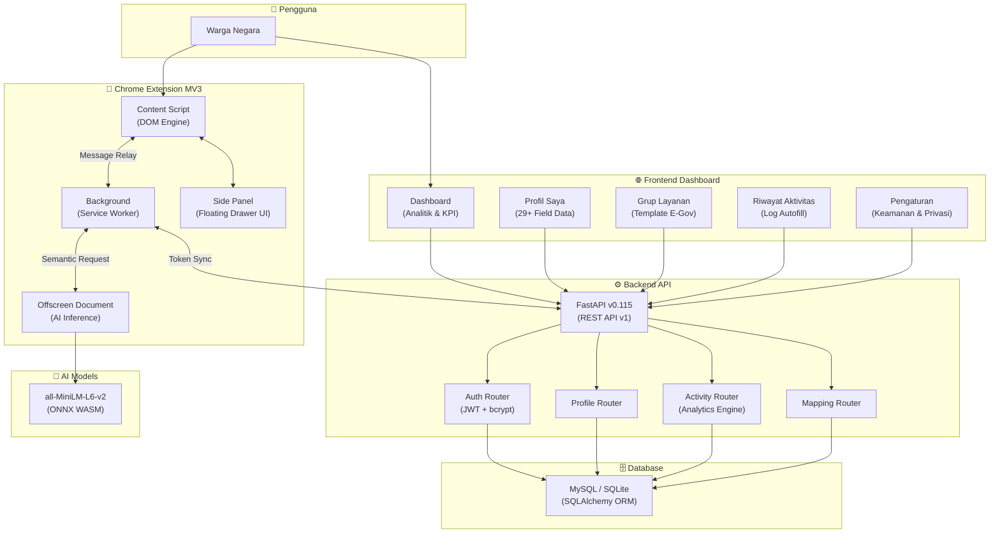

### 2.2 Alur Data Autofill (End-to-End)

```mermaid
sequenceDiagram
    participant U as Pengguna
    participant CS as Content Script
    participant BG as Background Worker
    participant OFF as Offscreen AI
    participant API as Backend API
    participant DB as Database

    U->>CS: Membuka halaman formulir
    CS->>CS: Deteksi form fields (MutationObserver)
    CS->>CS: Pass 0-3: Cascade Matching (W3C, Lexical, BM25, Jaro-Winkler)
    
    alt Semua field cocok (skor >= 0.55)
        CS->>BG: REQUEST_PROFILE_DATA
        BG->>API: GET /api/v1/profile/me
        API->>DB: Query Profile
        DB-->>API: Profile Data
        API-->>BG: JSON Response
        BG-->>CS: Profile Data
        CS->>CS: Inject values ke form fields
    else Beberapa field gagal match
        CS->>BG: SEMANTIC_FALLBACK (label abstrak)
        BG->>OFF: Forward ke AI
        OFF->>OFF: SBERT Embedding + Cosine Similarity
        OFF-->>BG: SEMANTIC_RESULT
        BG-->>CS: Matched field keys
        CS->>CS: Inject remaining values
    end

    CS->>BG: LOG_ACTIVITY
    BG->>API: POST /api/v1/activities
    API->>DB: Insert Activity Log
```

### 2.3 Struktur File Proyek

```text
E-Government/
├── backend/                    # REST API Server
│   ├── app/
│   │   ├── api/v1/routers/    # auth.py, profile.py, activity.py, mapping.py
│   │   ├── core/              # config.py, security.py
│   │   ├── models/            # entities.py (User, Profile, Activity, Mapping)
│   │   ├── schemas/           # schemas.py (Pydantic v2 validation)
│   │   ├── services/          # activity_service.py, profile_service.py
│   │   ├── database.py        # SQLAlchemy engine & session
│   │   └── main.py            # FastAPI app, middleware, exception handlers
│   ├── alembic/               # Database migrations
│   ├── tests/                 # Pytest test suite
│   ├── requirements.txt       # Python dependencies (13 packages)
│   └── docker-compose.yml     # Container orchestration
├── frontend/                   # React Web Dashboard
│   └── src/
│       ├── pages/             # Dashboard, Profile, Templates, Activity, Settings, Login, Register
│       ├── components/        # Layout.tsx, ui/ (reusable components)
│       ├── context/           # AuthContext.tsx (global auth state)
│       ├── services/          # api.ts (axios client + interceptors)
│       ├── App.tsx            # Router configuration
│       └── main.tsx           # Entry point
├── extension/                  # Chrome Extension (Manifest V3)
│   ├── manifest.json          # MV3 config, CSP, permissions
│   ├── background.js          # Service Worker (message broker, token sync)
│   ├── content_script.js      # DOM engine (cascade matching, form detection)
│   ├── offscreen.html/js      # AI inference container (SBERT)
│   ├── sidepanel.html/js      # Floating drawer UI
│   ├── popup.html/js          # Quick action popup
│   └── lib/                   # transformers.js, ONNX WASM binaries
├── test-form.html             # Integration test bed
├── test-page/                 # Legacy test forms
└── docs/                      # Documentation
```

---

## 3. Statistik Kode Sumber

### 3.1 Volume Kode per Komponen

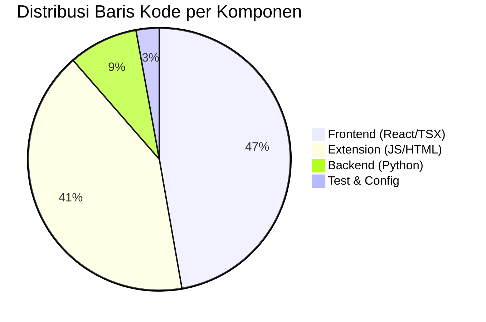

| Komponen | Bahasa | Estimasi LoC | File Utama |
|---|---|---|---|
| **Frontend** | TypeScript/TSX | ~6,626 | Dashboard.tsx (883), Profile.tsx (2,700+), Templates.tsx (824), Activity.tsx (342), Settings.tsx (417), Layout.tsx (497) |
| **Extension** | JavaScript/HTML | ~5,800 | content_script.js (3,100+), sidepanel.js (950+), sidepanel.html (800+), background.js (270+), offscreen.js (300+), popup.js (300+) |
| **Backend** | Python | ~1,200 | main.py (176), entities.py (141), schemas.py (212), activity.py (178), auth.py (130+), profile.py (80+), services (~300) |
| **Total** | - | **~14,000+** | **25+ files inti** |

### 3.2 Ukuran File (Top 10)

| # | File | Ukuran | Deskripsi |
|---|---|---|---|
| 1 | `Profile.tsx` | 127 KB | Halaman profil 29+ field dengan section progress |
| 2 | `content_script.js` | 116 KB | DOM engine + 7-pass cascade matching |
| 3 | `Templates.tsx` | 43 KB | 6 template e-Gov + field mapping |
| 4 | `Dashboard.tsx` | 41 KB | KPI cards, chart tren, tabel aktivitas |
| 5 | `sidepanel.js` | 36 KB | Logika UI floating drawer extension |
| 6 | `sidepanel.html` | 32 KB | Markup + CSS sidebar extension |
| 7 | `Layout.tsx` | 25 KB | Sidebar nav, search, notifications |
| 8 | `Settings.tsx` | 21 KB | Pengaturan keamanan & privasi |
| 9 | `Activity.tsx` | 15 KB | Tabel riwayat aktivitas full-load |
| 10 | `popup.html` | 13 KB | Quick action popup extension |

---

## 4. Progress per Modul

### 4.1 Backend API

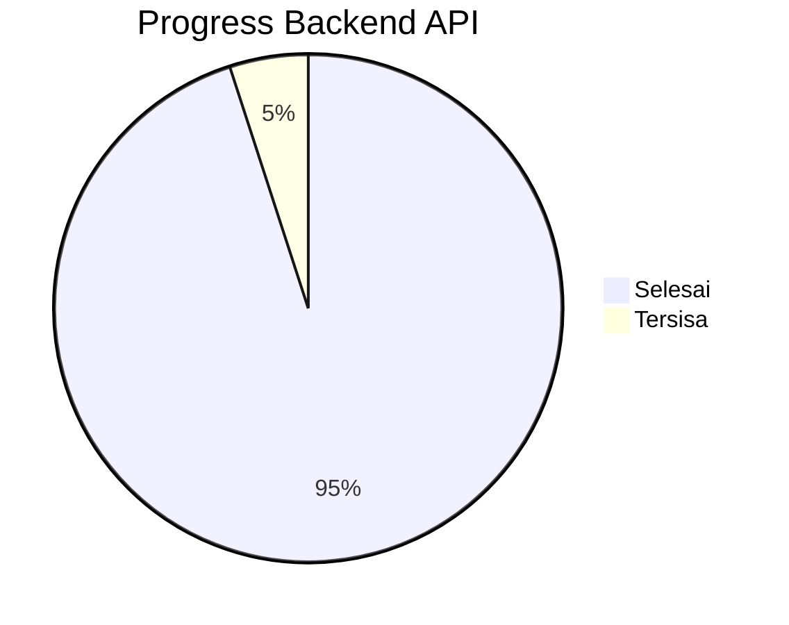

| Modul | Status | Progress | Detail |
|---|---|---|---|
| Autentikasi (JWT + bcrypt) | ✅ Selesai | 100% | Register, Login, Me, Change Password |
| Profil CRUD (29+ field) | ✅ Selesai | 100% | GET, PUT, PATCH /profile/me |
| Activity Logging | ✅ Selesai | 100% | POST (async buffer), GET, DELETE, Analytics |
| Field Mapping CRUD | ✅ Selesai | 100% | Per-domain mapping, bulk create, upsert |
| Rate Limiting (SlowAPI) | ✅ Selesai | 100% | Per-IP/token, configurable limits |
| CORS Hardening | ✅ Selesai | 100% | Origin whitelist, credential support |
| Error Handling Global | ✅ Selesai | 100% | Validation, HTTP, Rate Limit, Unhandled |
| Database Migration (Alembic) | ✅ Selesai | 95% | Alembic configured, initial migration done |
| Unit/Integration Tests | ⚠️ Parsial | 60% | Pytest configured, coverage belum penuh |
| **Admin API Endpoints** | ❌ Belum | 0% | *Direncanakan untuk Dashboard Admin* |

### 4.2 Frontend Dashboard

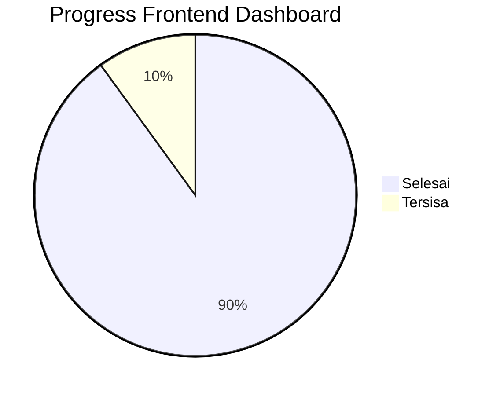

| Modul | Status | Progress | Detail |
|---|---|---|---|
| Login & Register | ✅ Selesai | 100% | Form validation, error feedback, redirect |
| Layout & Navigation | ✅ Selesai | 100% | Responsive sidebar, breadcrumb, search, notifications |
| Dashboard Analitik | ✅ Selesai | 100% | 4 KPI cards, area chart, pie chart, tabel aktivitas, audit privasi |
| Profil Saya | ✅ Selesai | 100% | 29+ field, section progress, floating save bar, foto dokumen |
| Grup Layanan (Templates) | ✅ Selesai | 100% | 6 template pemerintah, custom template, field readiness check |
| Riwayat Aktivitas | ✅ Selesai | 100% | Tabel full-load, delete, bulk select, refresh |
| Pengaturan | ✅ Selesai | 100% | Ganti password, strength meter, hapus riwayat |
| UI Components (Reusable) | ✅ Selesai | 100% | Card, Button, StatCard, EmptyState, Flaticon, FontAwesome |
| Responsive Design | ✅ Selesai | 95% | Mobile-first, breakpoint sm/md/lg |
| **Admin Dashboard** | ❌ Belum | 0% | *Direncanakan sebagai modul terpisah* |

### 4.3 Chrome Extension

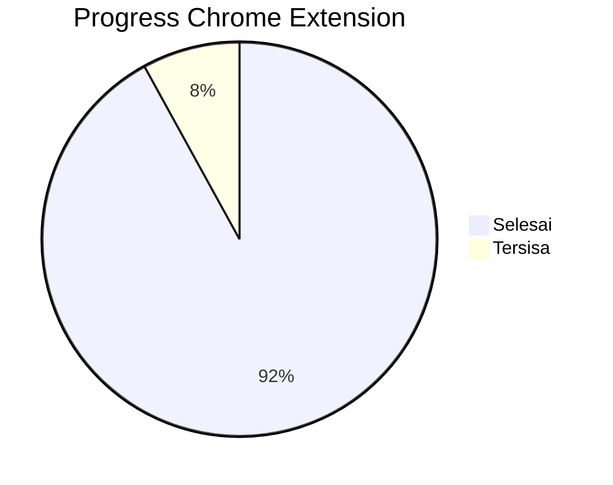

| Modul | Status | Progress | Detail |
|---|---|---|---|
| Manifest V3 Configuration | ✅ Selesai | 100% | CSP, COOP/COEP, permissions, web_accessible_resources |
| Content Script (DOM Engine) | ✅ Selesai | 100% | Shadow DOM piercing, MutationObserver, cascade matching |
| Background Service Worker | ✅ Selesai | 100% | Message relay, tab bridging, token sync |
| Offscreen AI Inference | ✅ Selesai | 100% | SBERT loading, cosine similarity, singleton pattern |
| Side Panel (Floating Drawer) | ✅ Selesai | 100% | iframe injection, overlay style, field review UI |
| Popup Quick Action | ✅ Selesai | 100% | Status check, quick launch |
| Hybrid Cascade Pipeline | ✅ Selesai | 100% | 7-pass: W3C > Lexical > Date > Context > BM25 > Jaro-Winkler > SBERT |
| Success Popup (Animated) | ✅ Selesai | 100% | Centang animasi, rincian field filled/skipped/failed |
| Dashboard Page Detection | ✅ Selesai | 100% | Skip autofill pada halaman dashboard GovConnect |
| Loading Animation | ✅ Selesai | 100% | Spinner saat loading data profil |
| OCR KTP Module | ❌ Belum | 0% | *Roadmap fase 2* |
| Liveness Detection | ❌ Belum | 0% | *Roadmap fase 2* |

---

## 5. Chart Progress Keseluruhan

### 5.1 Progress Agregat Sistem

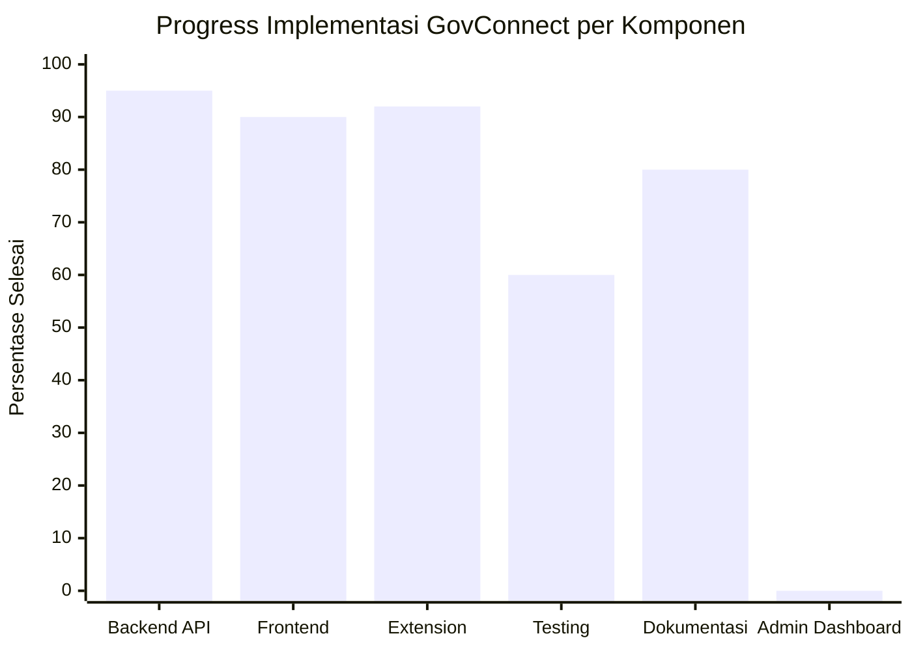

### 5.2 Distribusi Waktu Pengembangan

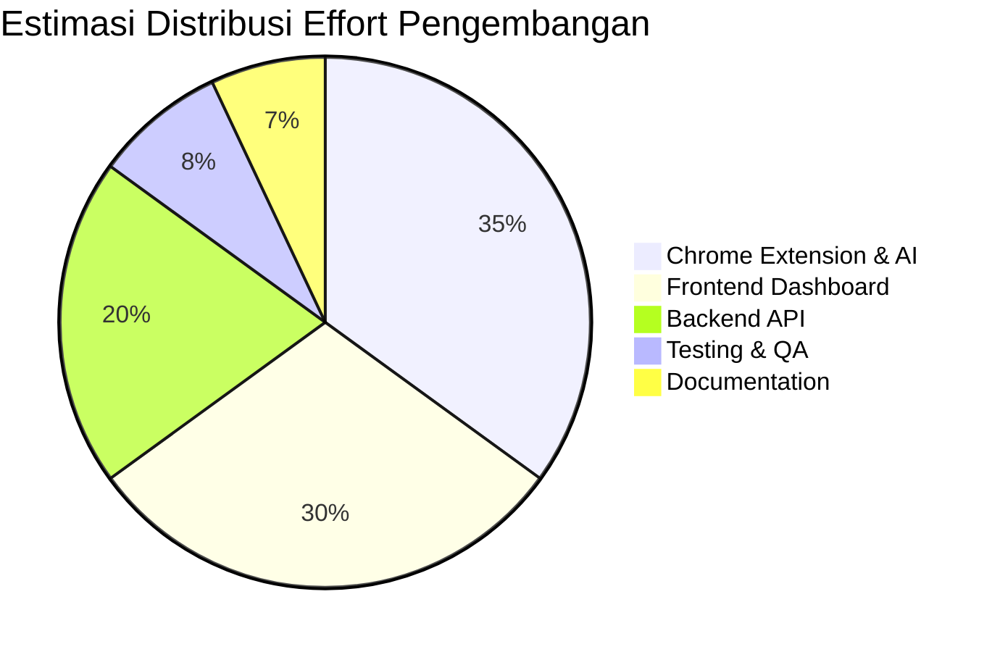

### 5.3 Timeline Milestone

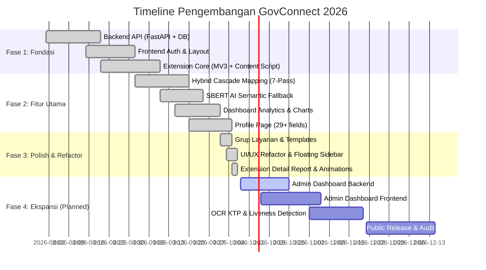

---

## 6. Detail Fitur per Komponen

### 6.1 Backend API — Endpoint Reference

| Method | Endpoint | Deskripsi | Auth |
|---|---|---|---|
| `POST` | `/api/v1/auth/register` | Registrasi pengguna baru | ❌ |
| `POST` | `/api/v1/auth/login` | Login (OAuth2 form) → JWT Token | ❌ |
| `GET` | `/api/v1/auth/me` | Info user yang sedang login | ✅ |
| `POST` | `/api/v1/auth/change-password` | Ganti kata sandi | ✅ |
| `GET` | `/api/v1/profile/me` | Ambil profil lengkap user | ✅ |
| `PUT` | `/api/v1/profile/me` | Update seluruh profil | ✅ |
| `PATCH` | `/api/v1/profile/me` | Update sebagian profil | ✅ |
| `GET` | `/api/v1/activities` | Daftar log aktivitas (filter, pagination) | ✅ |
| `POST` | `/api/v1/activities` | Catat aktivitas autofill (async buffer) | ✅ |
| `GET` | `/api/v1/activities/stats` | Statistik ringkasan (count, rate) | ✅ |
| `GET` | `/api/v1/activities/analytics` | Analitik lengkap (daily trend, by website, top fields) | ✅ |
| `DELETE` | `/api/v1/activities/{id}` | Hapus satu catatan aktivitas | ✅ |
| `DELETE` | `/api/v1/activities` | Hapus semua riwayat aktivitas user | ✅ |
| `GET` | `/api/v1/mappings` | Daftar custom field mapping (per domain) | ✅ |
| `POST` | `/api/v1/mappings` | Buat/update satu mapping | ✅ |
| `POST` | `/api/v1/mappings/bulk` | Bulk create mappings | ✅ |
| `DELETE` | `/api/v1/mappings/{id}` | Hapus satu mapping | ✅ |

### 6.2 Database Schema (4 Entitas)

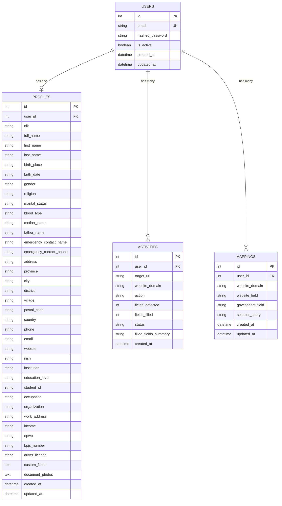

### 6.3 Frontend — Halaman & Fitur

#### Dashboard (`/dashboard`)
- 4 KPI stat cards (Total Autofill, Tingkat Sukses, Waktu Tersimpan, Kelengkapan Profil)
- Area chart tren aktivitas 7 hari terakhir
- Pie chart distribusi hasil (Sukses / Parsial / Gagal)
- Tabel aktivitas terkini (5 terbaru) dengan status badge
- Audit privasi data (transmisi field yang sering terpakai)

#### Profil Saya (`/profile`)
- 29+ field kependudukan terstruktur dalam 7 kategori:
  - Identitas Pokok, Alamat Domisili, Kontak Pribadi, Data Keluarga, Pendidikan, Pekerjaan & Keuangan, Dokumen Resmi
- Section progress bar per kategori
- Floating save bar (muncul saat ada perubahan)
- Upload foto dokumen (KTP, KK, Pasfoto)
- Custom fields (user-defined key-value pairs)

#### Grup Layanan (`/templates`)
- 6 template layanan pemerintah bawaan:
  - Dukcapil (KTP, KK, Akta)
  - Kepolisian (SKCK, SIM)
  - BKN/SSCASN (CPNS, PPPK)
  - Pajak (CoreTax, NPWP)
  - BPJS Kesehatan & Ketenagakerjaan
  - Imigrasi (Paspor)
- Custom template builder
- Field readiness checker (cek apakah profil user sudah lengkap untuk template tertentu)

#### Riwayat Aktivitas (`/activity`)
- Tabel full-load (muat semua data sekaligus)
- Select all / individual row selection
- Delete per item & clear all
- Refresh data manual
- Sinkronisasi data dengan endpoint analytics dashboard

#### Pengaturan (`/settings`)
- Ganti kata sandi (with strength meter & criteria checklist)
- Hapus seluruh riwayat aktivitas (dengan konfirmasi)
- Informasi akun (email, tanggal bergabung)

### 6.4 Extension — Fitur Teknis

#### Content Script (DOM Engine)
- **Recursive Shadow DOM Piercing** — `querySelectorAllDeep()`
- **7-Pass Hybrid Cascade Matching:**
  - Pass 0: HTML5 Autocomplete attribute
  - Pass 1: Exact name/ID + Abbreviation Map
  - Pass 1.5: Date component dropdown detection
  - Pass 2: Tokenization + Context Modifiers
  - Pass 2.5: BM25 Lexical Similarity
  - Pass 3: Jaro-Winkler + Cosine Overlap (weighted scoring)
  - Pass 4: SBERT Semantic Fallback (offscreen AI)
- **Debounced MutationObserver** (400ms debounce, 1500ms hard ceiling)
- **Anti-loop guard** (`pendingSemanticRequests` Set)
- **Dashboard detection** — Skip autofill pada halaman GovConnect sendiri

#### Side Panel (Floating Drawer)
- Injected sebagai iframe overlay (bukan Chrome sidePanel API)
- Field review UI: daftar field terdeteksi, matched, dan status
- Close button + keyboard shortcut
- Responsive width

#### Offscreen AI
- SBERT `all-MiniLM-L6-v2` (ONNX quantized)
- Singleton pattern loading
- Single-threaded WASM (`numThreads = 1`)
- Local bundled — zero CDN dependency

---

## 7. Rencana Admin Dashboard

### 7.1 Arsitektur Admin Dashboard

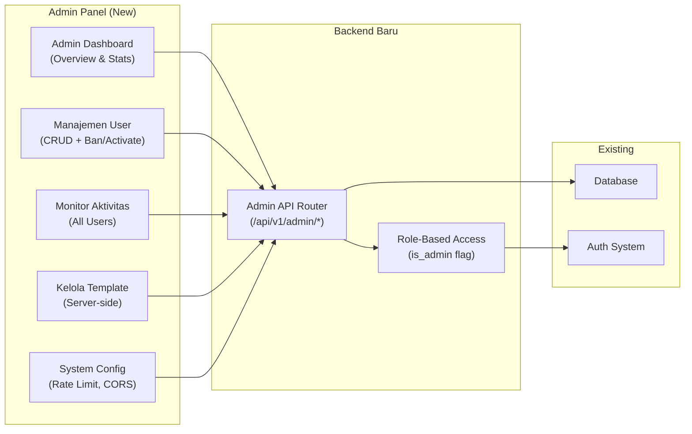

### 7.2 Fitur yang Direncanakan

| # | Fitur | Prioritas | Deskripsi |
|---|---|---|---|
| 1 | **Admin Login & Role Guard** | 🔴 Tinggi | Field `is_admin` di tabel User, middleware admin-only |
| 2 | **Dashboard Overview** | 🔴 Tinggi | Total users, active users, total autofill hari ini, system health |
| 3 | **Manajemen Pengguna** | 🔴 Tinggi | List users, search, activate/deactivate, view profile, reset password |
| 4 | **Monitor Aktivitas Global** | 🟡 Sedang | Semua log aktivitas dari semua user, filter by user/domain/status |
| 5 | **Statistik Penggunaan** | 🟡 Sedang | Chart tren pengguna baru, top websites, distribusi status |
| 6 | **Kelola Template** | 🟢 Rendah | CRUD template dari server (bukan hardcoded di frontend) |
| 7 | **System Configuration** | 🟢 Rendah | Edit rate limit, CORS origins, maintenance mode |
| 8 | **Audit Log Admin** | 🟢 Rendah | Mencatat semua aksi admin (siapa, kapan, apa) |

### 7.3 Perubahan Backend yang Diperlukan

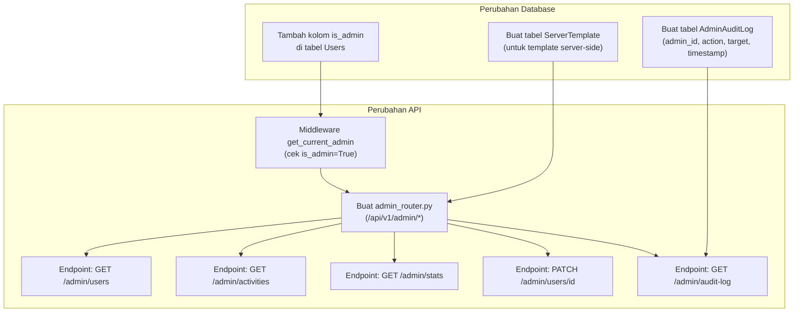

### 7.4 Perubahan Frontend yang Diperlukan

| Komponen | File Baru | Deskripsi |
|---|---|---|
| Admin Layout | `AdminLayout.tsx` | Layout khusus admin dengan sidebar navigasi berbeda |
| Admin Dashboard | `AdminDashboard.tsx` | Overview KPI: total users, autofills today, system health |
| User Management | `AdminUsers.tsx` | Tabel CRUD pengguna, search, pagination, status toggle |
| Activity Monitor | `AdminActivities.tsx` | Tabel semua aktivitas global, filter multi-user |
| System Stats | `AdminStats.tsx` | Chart tren registrasi, top websites, distribusi status |
| Template Manager | `AdminTemplates.tsx` | CRUD template layanan dari admin panel |
| Admin Guard Route | `AdminRoute.tsx` | Protected route yang cek `is_admin` |

### 7.5 Estimasi Effort Admin Dashboard

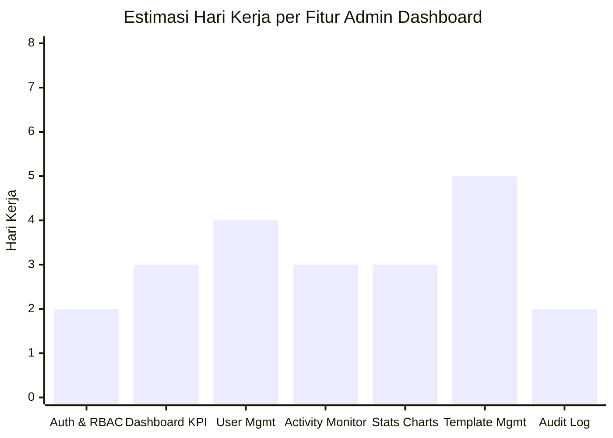

**Total estimasi: ~22 hari kerja** (plus 3 hari untuk testing & QA)

---

## 8. Roadmap Pengembangan Lanjutan

### 8.1 Gantt Chart Roadmap Q4 2026

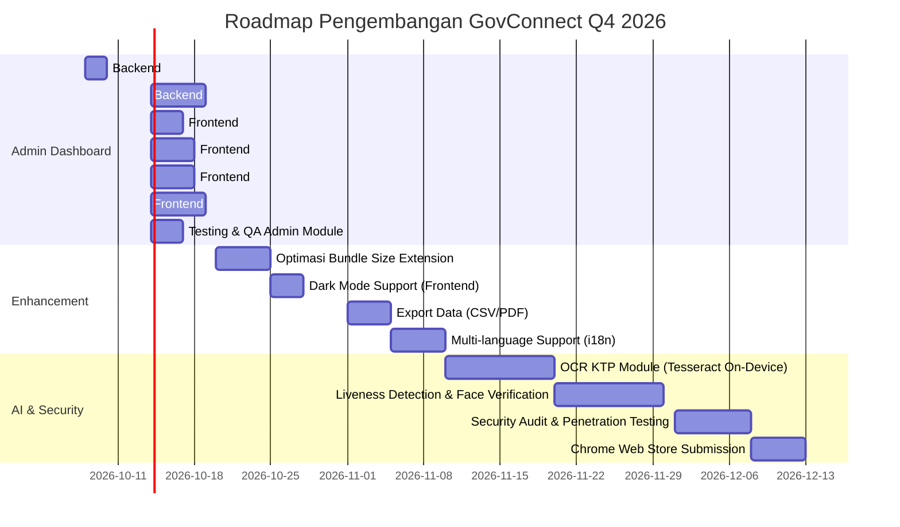

### 8.2 Daftar Enhancement yang Direncanakan

| # | Fitur | Kategori | Prioritas | ETA |
|---|---|---|---|---|
| 1 | Admin Dashboard | Core | 🔴 Tinggi | Oktober 2026 |
| 2 | Dark Mode | UI/UX | 🟡 Sedang | Oktober 2026 |
| 3 | Export Data (CSV/PDF) | Utility | 🟡 Sedang | November 2026 |
| 4 | Multi-language (ID/EN) | i18n | 🟡 Sedang | November 2026 |
| 5 | OCR KTP | AI | 🟡 Sedang | November 2026 |
| 6 | Notification System (Real-time) | Backend | 🟢 Rendah | November 2026 |
| 7 | Liveness Detection | AI/Security | 🟢 Rendah | November 2026 |
| 8 | PWA Support | Frontend | 🟢 Rendah | Desember 2026 |
| 9 | Security Audit | Compliance | 🔴 Tinggi | Desember 2026 |
| 10 | Chrome Web Store Release | Distribution | 🔴 Tinggi | Desember 2026 |

---

## 9. Risiko & Mitigasi

| # | Risiko | Dampak | Probabilitas | Mitigasi |
|---|---|---|---|---|
| 1 | SBERT model terlalu besar untuk distribusi CWS | 🔴 Tinggi | Sedang | Evaluasi model quantized yang lebih kecil (MiniLM-L3) |
| 2 | CORS issues pada portal e-Gov production | 🟡 Sedang | Tinggi | Fallback ke popup mode, dokumentasi whitelist domain |
| 3 | Admin dashboard meningkatkan attack surface | 🔴 Tinggi | Rendah | RBAC ketat, audit log, rate limit admin endpoints |
| 4 | Database performance degradation (banyak user) | 🟡 Sedang | Rendah | Connection pooling, index optimization, Redis caching |
| 5 | Breaking changes Chrome Extension API | 🟡 Sedang | Rendah | Pin versi manifest, monitor Chrome beta channel |

---

**Dokumen ini dibuat secara otomatis berdasarkan analisis kode sumber langsung dari repository GovConnect. Tidak ada perubahan kode yang dilakukan dalam pembuatan laporan ini.**

---

**GovConnect — Workshop Pemrograman Framework, Semester 3, 2026**
