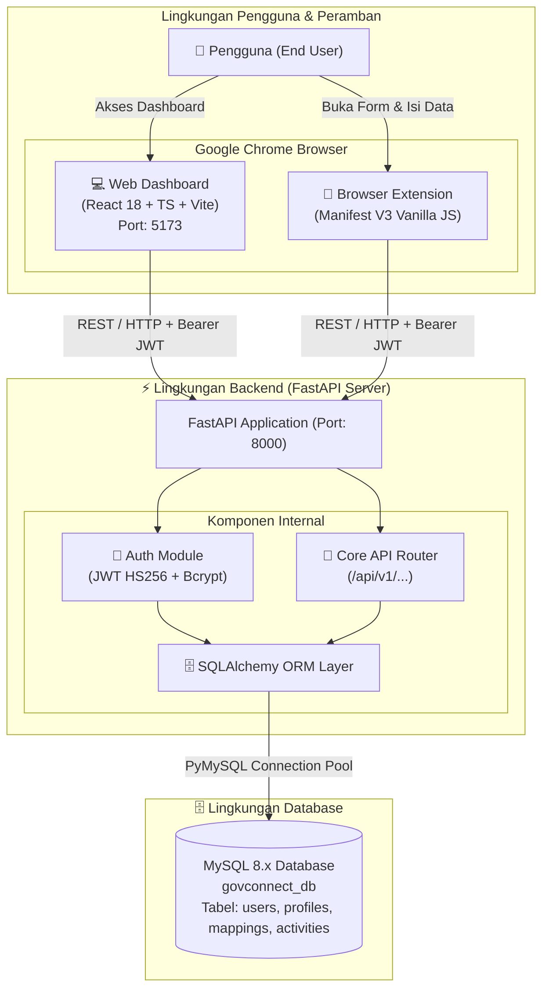
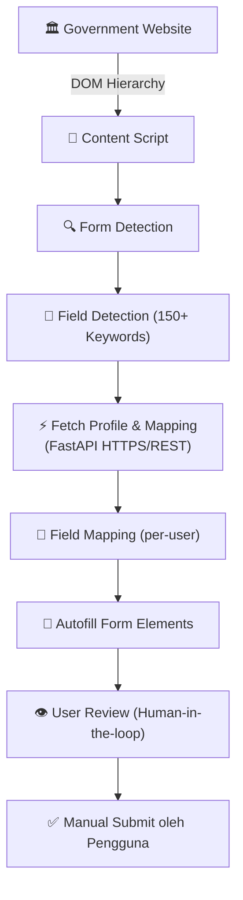

# System Architecture — GovConnect (Revisi)

**Versi:** 1.1 — melengkapi draft awal (fetch profile/mapping, Background Service Worker, auth pairing, deployment layer)

---

## 1. Arsitektur Utama
 


## 2. Government Website Integration

Government website **tidak** terhubung ke backend GovConnect. Extension berinteraksi langsung dengan DOM halaman, dan mengambil data profil/mapping dari FastAPI **sebelum** proses autofill dijalankan.



FastAPI hanya menangani data & layanan GovConnect — bukan perantara antara extension dan website pemerintah.

## 3. Komponen Sistem

| Komponen | Fungsi |
|---|---|
| Chrome Extension | Client utama untuk autofill |
| Popup | Login dan entry point |
| Side Panel | Interface proses autofill |
| Content Script | Membaca dan memanipulasi field pada DOM |
| Background Service Worker | Mengelola sesi/token extension & komunikasi antar komponen extension |
| Field Detection | Mengenali field formulir |
| Field Mapping | Mencocokkan field dengan profile (per-user) |
| Autofill Engine | Mengisi field |
| Web Dashboard | Mengelola profile dan aktivitas |
| FastAPI | Backend REST API |
| MySQL | Penyimpanan data |

## 4. Data Flow

**Profile**
```
User → Web Dashboard → FastAPI → MySQL
```

**Autofill**
```
Government Website
        ↓
Content Script
        ↓
Field Detection
        ↓
Fetch Profile & Mapping (FastAPI → MySQL)
        ↓
Field Mapping
        ↓
Autofill
        ↓
User Review
        ↓
Manual Submit
```

**Activity**
```
Autofill Result
      ↓
Chrome Extension
      ↓
FastAPI
      ↓
activity_logs
      ↓
Dashboard Analytics
```

## 5. Autentikasi & Extension Pairing

Extension dan Dashboard adalah dua client terpisah yang harus terhubung ke akun yang sama.

```
Web Dashboard          Chrome Extension
Login (email/pass)          │
     ↓                      │
FastAPI: verify + issue JWT │
     ↓                      │
Dashboard menyimpan JWT     │
     ↓                      │
"Connect Extension"         │
  (tampilkan pairing code / QR)
     ↓                      │
                        Popup: masukkan
                        pairing code
                             ↓
                     FastAPI: tukar code → JWT
                             ↓
              Background Service Worker
              menyimpan JWT (chrome.storage)
                             ↓
                Extension siap autentikasi
                setiap request ke FastAPI
```

Setiap request dari Extension maupun Dashboard ke FastAPI membawa JWT ini di header `Authorization`.

## 6. Batas Sistem

```
┌──────────────────────── GOVCONNECT ────────────────────────┐
│                                                              │
│   Chrome Extension  ──HTTPS/JWT──▶  FastAPI  ──▶  MySQL      │
│         ▲                             ▲          (users,     │
│         │                             │           profiles,  │
│   Web Dashboard  ────HTTPS/JWT────────┘           mappings,  │
│                                                    activities)│
└──────────────────────────────┬───────────────────────────────┘
                                │ DOM Interaction only
                                ▼
                     Government Website
```

Batas utama: GovConnect hanya membantu mengisi formulir. Pengguna tetap melakukan review dan submit pada website pemerintah. GovConnect tidak punya akses ke database internal pemerintah.

## 7. Deployment / Infrastructure

```
                        ┌─────────────────────────┐
                        │         Nginx           │
                        │   (reverse proxy, TLS)   │
                        └────────────┬─────────────┘
                                     │
                  ┌──────────────────┼──────────────────┐
                  │                                     │
                  ▼                                     ▼
        ┌───────────────────┐               ┌───────────────────┐
        │  Web Dashboard     │               │   FastAPI          │
        │  (static build,    │               │   (Docker container)│
        │  served via Nginx) │               │                     │
        └────────────────────┘               └──────────┬──────────┘
                                                          │
                                                          ▼
                                              ┌───────────────────┐
                                              │      MySQL         │
                                              │  (Docker container, │
                                              │   volume persisted) │
                                              └───────────────────┘

Semua service (Nginx, FastAPI, MySQL) dijalankan via Docker Compose
dalam satu jaringan internal (docker network).

Chrome Extension TIDAK dideploy sebagai container — didistribusikan
lewat Chrome Web Store, berjalan di browser pengguna (client-side).
```

**Catatan:**
- Nginx menjadi satu-satunya entry point publik (HTTPS/TLS termination), meneruskan request ke Web Dashboard (static) atau FastAPI (`/api/*`).
- MySQL tidak diekspos ke luar jaringan Docker — hanya bisa diakses oleh FastAPI.
- Extension berkomunikasi ke FastAPI melalui domain publik yang sama (lewat Nginx), bukan langsung ke container.