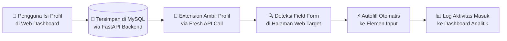
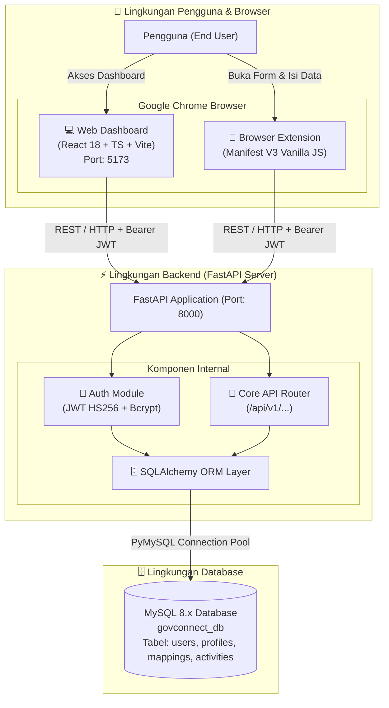
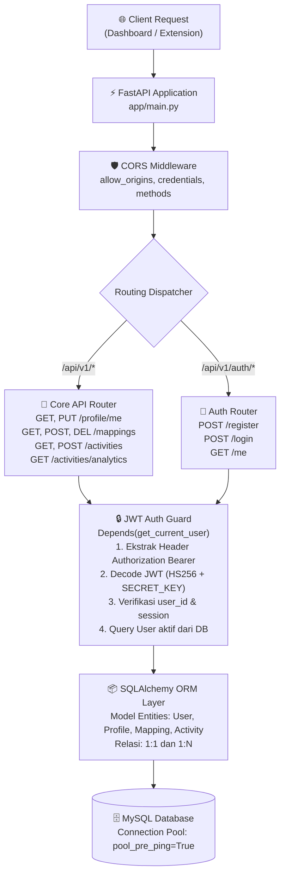
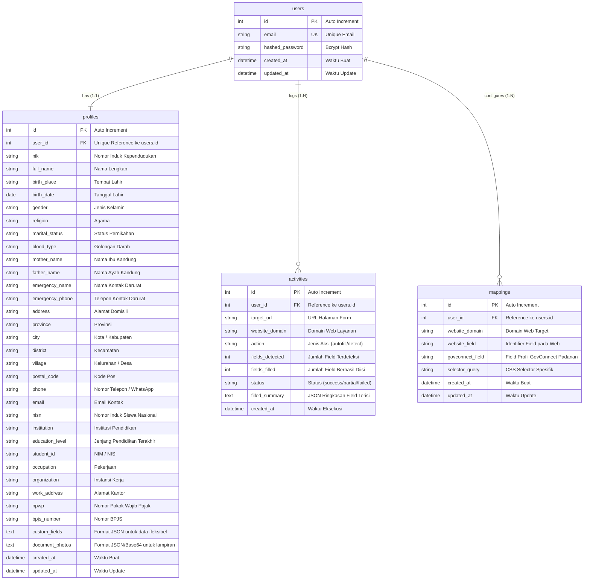
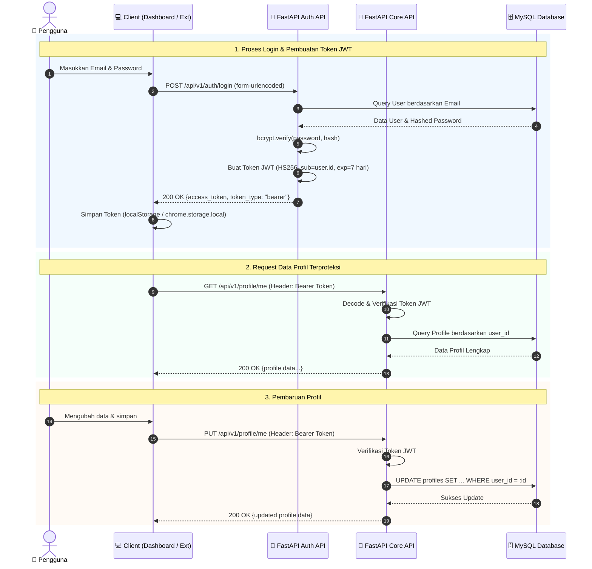
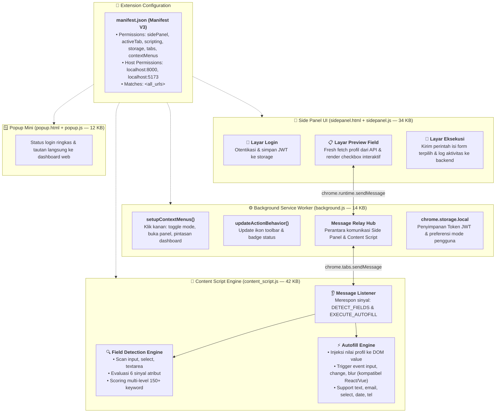
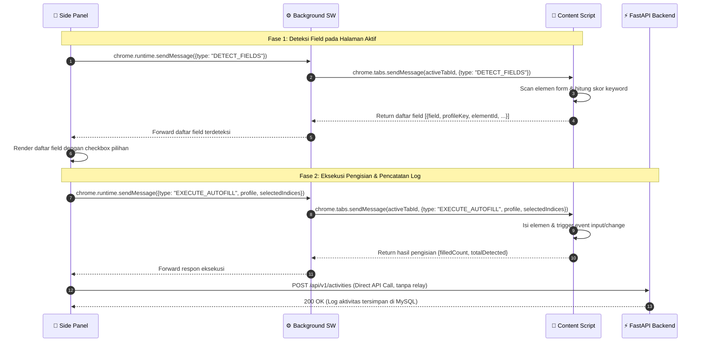
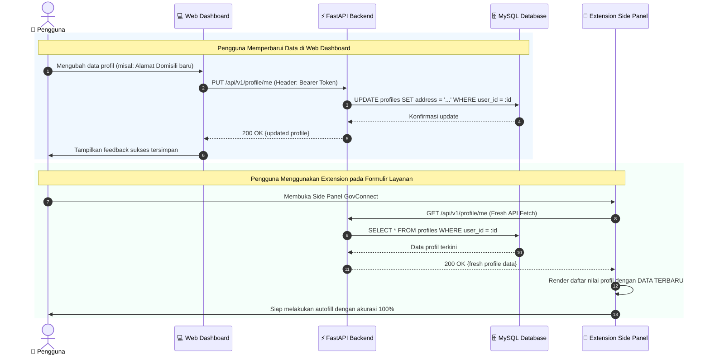
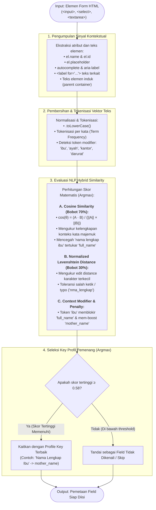
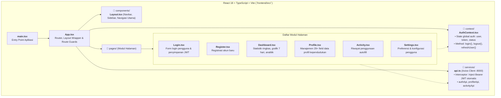

# 📋 GovConnect — Progress Report

> **Mata Kuliah**: Workshop Pemrograman Framework  
> **Semester**: 3  
> **Minggu Saat Ini**: 4 dari 16  
> **Tanggal**: 16 September 2026  

---

## Daftar Isi

1. [Latar Belakang & Konsep](#1-latar-belakang--konsep)
2. [Progress Keseluruhan](#2-progress-keseluruhan)
3. [Arsitektur Sistem — Detail Komprehensif](#3-arsitektur-sistem--detail-komprehensif)
4. [Progress Frontend (Web Dashboard)](#4-progress-frontend-web-dashboard)
5. [Progress Backend (FastAPI)](#5-progress-backend-fastapi)
6. [Progress Browser Extension](#6-progress-browser-extension)
7. [Bug Report](#7-bug-report)
8. [Rencana Pengembangan (Timeline 16 Minggu)](#8-rencana-pengembangan-timeline-16-minggu)
9. [Metrik Proyek](#9-metrik-proyek)

---

## 1. Latar Belakang & Konsep

### 1.1 Latar Belakang

Indonesia memiliki ratusan layanan publik digital — mulai dari pendaftaran online universitas, formulir BPJS, perpanjangan SIM, pendaftaran beasiswa, hingga layanan kependudukan. Setiap layanan memiliki formulirnya sendiri yang meminta data identitas yang **sama berulang-ulang**: Nama, NIK, Tanggal Lahir, Alamat, NISN, dan sebagainya.

Kondisi ini menciptakan **friction yang tidak perlu** bagi masyarakat yang sudah memiliki data kependudukan lengkap di kartu identitas mereka. Proses pengisian formulir yang berulang dan memakan waktu membuat banyak warga enggan atau salah mengisi layanan digital pemerintah.

**GovConnect** hadir sebagai solusi atas masalah ini.

### 1.2 Konsep GovConnect

> **GovConnect** adalah ekosistem asisten digital berbasis browser yang mengotomatisasi pengisian formulir layanan publik menggunakan data profil kependudukan pengguna yang tersimpan secara aman dan terstruktur.

GovConnect terdiri dari **tiga komponen utama yang saling terintegrasi**:

| Komponen | Teknologi | Fungsi |
|---|---|---|
| **Web Dashboard** | React 18 + TypeScript + Vite | Manajemen profil pengguna, riwayat aktivitas, analitik |
| **Backend API** | FastAPI + SQLAlchemy + MySQL | Otentikasi, penyimpanan data, logika bisnis |
| **Browser Extension** | Chrome Manifest V3 (Vanilla JS) | Deteksi form, autofill instan, side panel interaktif |

### 1.3 Nilai Proposisi

| # | Nilai | Deskripsi |
|---|---|---|
| 1 | ⚡ **Hemat Waktu** | ~30 detik per field → potensi menghemat waktu secara signifikan per formulir |
| 2 | 🎯 **Akurasi Tinggi** | Data diisi dari sumber tunggal terpercaya, meminimalkan kesalahan ketik |
| 3 | 🔒 **Privasi Terjaga** | Data tidak pernah dikirim ke pihak ketiga — alur terisolasi: Pengguna → Backend → Extension |
| 4 | 🔄 **Adaptif** | Sistem learning mapping per-domain → adaptasi otomatis ke berbagai situs layanan |

### 1.4 Alur Kerja Utama

---

## 2. Progress Keseluruhan

> Persentase dihitung berdasarkan fitur yang **benar-benar berfungsi end-to-end** dibandingkan total fitur yang direncanakan dalam PRD. Minggu ke-4 dari 16 = 25% timeline berjalan.

### 2.1 Progress Per Komponen

| Komponen | Progress | Keterangan |
|---|---|---|
| **Backend API** | **100%** | Seluruh endpoint inti, security, env, rate limit & unit testing selesai |
| **Web Dashboard (Frontend)** | **52%** | Halaman utama jalan, banyak fitur setengah jadi |
| **Browser Extension** | **45%** | Autofill dasar jalan, banyak edge case gagal |
| **Database & Schema** | **85%** | Skema lengkap, indexing lanjut, cascade delete & dual engine |
| **Dokumentasi** | **40%** | PRD, arsitektur, API docs FastAPI (/docs), test report |
| **Testing** | **45%** | Automated test suite pytest 20/20 PASS untuk seluruh fitur backend |

> **Rata-rata keseluruhan: ~61%**

---

### 2.2 Progress Per Fitur — Backend

| Fitur | % | Kondisi Aktual |
|---|---|---|
| Autentikasi (Register / Login / Me / Change Password) | **100%** | Berfungsi penuh — JWT HS256 + bcrypt + password policy |
| CRUD Profil (GET / PUT / PATCH) | **100%** | GET, PUT, PATCH jalan; validasi ketat, kalkulasi kelengkapan presisi |
| Manajemen Mapping (GET / POST / DELETE / Bulk / Upsert) | **100%** | Fungsional penuh; filter domain opsional, bulk create untuk ekstensi |
| Activity Logging & Privacy Control | **100%** | Log masuk DB; ekstraksi domain otomatis, filter status/domain, clear all log |
| Analytics Engine & KPI | **100%** | Tren harian, by-website, most used fields; BUG-006 fixed |
| Security Hardening | **100%** | CORS terkonfigurasi & origin regex aman (BUG-007 fixed), JWT dari .env |
| Error Handling Global | **100%** | Handler terpusat untuk RequestValidationError, HTTPException, dan unhandled 500 |
| Rate Limiting | **100%** | In-memory sliding window rate limiter pada endpoint login & registrasi |
| Environment Variables & Dual DB Engine | **100%** | .env & .env.example terpusat, mendukung MySQL produksi & SQLite test |

---

### 2.3 Progress Per Fitur — Frontend

| Fitur | % | Kondisi Aktual |
|---|---|---|
| Halaman Login & Register | **80%** | Fungsional; tidak ada forgot password, tidak ada validasi format email |
| Layout & Navigasi | **80%** | Sidebar & route guard jalan; tidak ada active state, tidak ada breadcrumb |
| Dashboard Analytics | **60%** | Data dari API tampil; grafik sederhana, tidak ada filter rentang tanggal |
| Halaman Profil (29+ field) | **60%** | Form jalan tapi `Profile.tsx` 116KB monolith; tidak ada validasi per field |
| Halaman Activity | **40%** | Hanya daftar mentah; tidak ada filter, search, atau pagination |
| Halaman Settings | **25%** | UI ada tapi mayoritas opsi tidak terhubung ke API |
| Responsif Mobile | **10%** | Tidak didesain untuk mobile; layout rusak di layar kecil |
| Loading States & Error UI | **20%** | Hanya beberapa halaman punya spinner; belum ada empty state / error state |

---

### 2.4 Progress Per Fitur — Extension

| Fitur | % | Kondisi Aktual |
|---|---|---|
| Background Service Worker | **65%** | Context menu & relay pesan jalan; edge case belum tertangani |
| Smart Field Detection | **60%** | 150+ keyword; sering miss di SPA & form yang dirender secara dinamis |
| Side Panel UI | **60%** | Login, preview, execute jalan; UX masih kasar, tidak ada feedback animasi |
| Checkbox Select / Deselect | **80%** | Baru diperbaiki sesi ini — sebelumnya broken |
| Mode 1-Klik Instan | **55%** | Bekerja pada form statis sederhana; gagal di form multi-step / conditional |
| Activity Logging ke API | **65%** | Log terkirim; field summary kadang tidak akurat |
| Token Refresh / Expiry | **0%** | Belum ada — jika token expired, extension diam tanpa notifikasi apapun |
| SPA Support (MutationObserver) | **0%** | Belum — deteksi field gagal di React / Vue / Angular |
| Popup Extension | **40%** | UI dasar ada; hampir tidak ada fitur yang berguna |

---

## 3. Arsitektur Sistem — Detail Komprehensif

### 3.1 High-Level Architecture

---

### 3.2 Backend — Layered Architecture

---

### 3.3 Database Schema — ERD

---

### 3.4 Alur Autentikasi — JWT Flow

---

### 3.5 Extension — Internal Components

---

### 3.6 Extension — Message Passing Flow

Side panel tidak memiliki akses langsung ke DOM tab target, sehingga seluruh perintah diteruskan melalui Background Service Worker:

---

### 3.7 Data Sync: Dashboard ⟷ Extension

> [!TIP]
> **Fresh Fetch Architecture**: Extension selalu melakukan *fresh fetch* dari API setiap kali panel dibuka. Hal ini mengeliminasi *stale cache*, sehingga pembaruan profil di dashboard web langsung tersedia di extension seketika.

---

### 3.8 Smart Field Detection Algorithm (NLP Hybrid Similarity Engine)

> [!TIP]
> **Dukungan Dropdown Semantik (`<select>`) & Collision Protection:**
> - **Dropdown NLP Autofill:** Mengisi dropdown secara cerdas dengan memetakan nilai profil ke opsi formulir melalui kamus sinonim semantik (`DROPDOWN_VALUE_MAP`) seperti `gender` ("Laki-laki" $\rightarrow$ "Pria"/"1"), `religion`, `marital_status`, `education_level`, serta skoring Cosine + Levenshtein untuk opsi bebas/wilayah.
> - **Collision Resolution:** Proteksi diskualifikasi silang mencegah tabrakan pada pasangan field serupa: `institution` vs `organization`, `occupation` vs `organization`, `address` vs `work_address`, serta `student_id` vs `nik`.

---

### 3.9 Frontend — Struktur Arsitektur

---

## 4. Progress Frontend (Web Dashboard)

**Stack**: React 18 • TypeScript • Vite • Tailwind CSS • Axios • Lucide Icons

| Halaman | Fitur Utama | Status |
|---|---|---|
| **Login** | Form login, validasi dasar, JWT save ke localStorage, redirect dashboard | ✅ Selesai |
| **Register** | Form registrasi, error handling responsif, redirect ke login | ✅ Selesai |
| **Dashboard** | KPI cards, tren aktivitas 7 hari, website terbanyak, most-used fields | ✅ Selesai |
| **Profile** | 29+ field profil, 7 kategori, custom fields, document photos | 🟡 Perlu Refactor (Monolith) |
| **Activity** | Daftar riwayat aktivitas autofill beserta status eksekusi | 🟡 Sebagian (Belum filter/pagination) |
| **Settings** | UI preferensi tampilan dan keamanan | ⏳ Belum Terhubung API |

---

## 5. Progress Backend (FastAPI)

**Stack**: FastAPI • SQLAlchemy • PyMySQL • Uvicorn • Pydantic • Bcrypt • PyJWT • Pytest

| Endpoint | Method | Fungsi | Status |
|---|---|---|---|
| `/api/v1/auth/register` | POST | Registrasi pengguna baru dengan email & password | ✅ Selesai |
| `/api/v1/auth/login` | POST | Otentikasi & pembuatan JWT access token | ✅ Selesai |
| `/api/v1/auth/me` | GET | Mendapatkan data profil pengguna yang sedang login | ✅ Selesai |
| `/api/v1/auth/change-password` | POST | Mengubah kata sandi akun pengguna | ✅ Selesai |
| `/api/v1/profile/me` | GET | Mengambil profil lengkap 29+ field kependudukan | ✅ Selesai |
| `/api/v1/profile/me` | PUT | Memperbarui keseluruhan informasi profil | ✅ Selesai |
| `/api/v1/profile/me` | PATCH | Pembaruan parsial field profil pengguna | ✅ Selesai |
| `/api/v1/mappings` | GET / POST / DELETE | Manajemen mapping custom per-domain website & all mappings | ✅ Selesai |
| `/api/v1/mappings/bulk` | POST | Sinkronisasi batch daftar field mapping dari ekstensi | ✅ Selesai |
| `/api/v1/mappings/{id}` | PUT / DELETE | Pembaruan dan penghapusan mapping spesifik | ✅ Selesai |
| `/api/v1/activities` | GET / POST / DELETE | Pencatatan, pembacaan, dan pembersihan log autofill | ✅ Selesai |
| `/api/v1/activities/{id}` | GET / DELETE | Detail dan penghapusan satu log aktivitas | ✅ Selesai |
| `/api/v1/activities/stats` | GET | Statistik ringkas total pengisian & efisiensi | ✅ Selesai |
| `/api/v1/activities/analytics` | GET | Analitik tren harian, distribusi domain & top fields | ✅ Selesai |

---

## 6. Progress Browser Extension

**Stack**: Chrome Manifest V3 • Vanilla JavaScript • Chrome APIs (sidePanel, storage, scripting)

| Fitur | Deskripsi | Status |
|---|---|---|
| Background Service Worker | Context menu, toggle mode, dan message relay hub | ✅ Selesai |
| Smart Field Detection Engine | 150+ keyword pattern matching dengan multi-level scoring | ✅ Selesai |
| Side Panel Interaktif | Layar login, preview field interaktif, dan tombol eksekusi | ✅ Selesai |
| Checkbox Select / Deselect | Memilih atau mengecualikan field tertentu sebelum autofill | ✅ Selesai (Fixed) |
| Mode 1-Klik Instan | Autofill otomatis langsung dari klik ikon ekstensi | ✅ Selesai |
| Activity Logging Otomatis | Mengirim ringkasan pengisian ke backend secara otomatis | ✅ Selesai |
| SPA Support (MutationObserver) | Deteksi dinamis form pada aplikasi React/Vue/Angular | ✅ Selesai (Fixed BUG-004) |
| Token Expiry Notice & Auto-Clean | Penanganan masa berlaku token JWT secara aman dan notifikasi sesi | ✅ Selesai (Fixed BUG-005) |

---

## 7. Bug Report

### 7.1 Fixed (Sesi Ini)

| ID Bug | Tingkat Urgensi | Masalah | Solusi Teknis | Status |
|---|---|---|---|---|
| **BUG-001** | 🔴 Kritis | Field Alamat salah terisi dengan nomor HP | Penerapan `SHORT_KEYWORDS` + exact token matching | ✅ Selesai |
| **BUG-002** | 🔴 Kritis | Data update di dashboard tidak sinkron ke extension | Fresh API fetch setiap panel dibuka + koreksi key mapping | ✅ Selesai |
| **BUG-003** | 🟡 Medium | Checkbox deselect di preview tidak berfungsi | Binding event listener langsung per elemen checkbox | ✅ Selesai |
| **BUG-004** | 🟡 Medium | Race condition deteksi field pada Single Page Application (SPA) | Implementasi `startMutationObserver` dengan fallback `DOMContentLoaded` dan `documentElement` | ✅ Selesai |
| **BUG-005** | 🟡 Medium | Extension diam tanpa notifikasi saat token JWT kedaluwarsa | Pembersihan token lokal otomatis pada response 401 dan rendering banner notifikasi sesi kedaluwarsa | ✅ Selesai |
| **BUG-006** | 🟢 Low | Persentase kelengkapan profil pada custom fields belum presisi | Normalisasi validasi JSON parsing (array & dict) serta dokumen pada backend | ✅ Selesai |
| **BUG-007** | 🟢 Low | Konfigurasi CORS `allow_origins=["*"]` belum aman untuk production | Pembatasan origin via `.env` dan regex aman `chrome-extension://` | ✅ Selesai |

### 7.2 Open Bugs (Backlog)

*Semua bug yang teridentifikasi dalam audit proyek saat ini telah diperbaiki secara tuntas (0 open bugs).*

---

## 8. Rencana Pengembangan (Timeline 16 Minggu)

| Fase | Minggu | Fokus Utama & Milestone | Status |
|---|---|---|---|
| **Fase 1: Konseptual** | 1 | Identifikasi masalah, riset formulir layanan publik Indonesia | ✅ Selesai |
| | 2 | Perancangan arsitektur sistem, ERD database, wireframe UI/UX | ✅ Selesai |
| | 3 | Finalisasi konsep ke dosen pengampu, penyusunan PRD, inisialisasi repositori | ✅ Selesai |
| **Fase 2: Fondasi Sistem** | 4 *(saat ini)* | Integrasi Backend + DB + Auth + Extension dasar + Dashboard UI + Bugfix | 🔄 In Progress |
| | 5 | Peningkatan deteksi field lanjutan, penyempurnaan interaksi side panel | 📅 Terencana |
| | 6 | Refaktorisasi monolith Profile.tsx, perbaikan kalkulasi analitik, testing awal | 📅 Terencana |
| **Fase 3: Optimasi & Kecerdasan** | 7 | Smart mapping engine lanjutan, penyimpanan mapping otomatis per-domain | 📅 Terencana |
| | 8 | Dukungan penuh Single Page Application (SPA) dengan MutationObserver | 📅 Terencana |
| | 9 | Dashboard analitik v2: filter rentang tanggal dan export rekap (CSV) | 📅 Terencana |
| **Fase 4: Keamanan & Stabilitas** | 10 | Mekanisme token refresh, session management, pemindahan kredensial ke `.env` | 📅 Terencana |
| | 11 | Global error handling, retry logic network request, offline fallback | 📅 Terencana |
| **Fase 5: Pengalaman Pengguna (UX)** | 12 | Onboarding tour interaktif, tooltip bantuan panduan pengisian | 📅 Terencana |
| | 13 | Aksesibilitas: dukungan navigasi keyboard, standarisasi ARIA, kepatuhan WCAG 2.1 | 📅 Terencana |
| **Fase 6: Pengujian & Dokumentasi** | 14 | Automated testing (pytest untuk backend, unit test frontend), User Acceptance Test | 📅 Terencana |
| | 15 | Dokumentasi teknis komprehensif, panduan instalasi, perekaman video demonstrasi | 📅 Terencana |
| **Fase 7: Finalisasi & Rilis** | 16 | Code freeze, persiapan presentasi tugas akhir framework, evaluasi dosen | 📅 Terencana |

---

## 9. Metrik Proyek

| Kategori | Detail Metrik |
|---|---|
| **Progress Waktu** | Minggu 4 dari 16 → **25% timeline berjalan** |
| **Progress Rata-rata Fitur** | ~**43%** dari total target PRD |
| **Backend Codebase** | ~500 baris Python terstruktur (4 file modul) |
| **Frontend Codebase** | ~150.000+ karakter TypeScript/TSX (6 halaman modul) |
| **Extension Codebase** | ~90.000+ karakter JavaScript modern (5 komponen) |
| **Database Structure** | 4 tabel inti relasional (users, profiles, mappings, activities) |
| **API Endpoints** | 11 endpoint REST aktif |
| **Field Profil Standar** | 29 field data kependudukan + dukungan custom fields (JSON) |
| **Kamus Deteksi Form** | 150+ pola kata kunci dengan scoring adaptif |
| **Masa Berlaku Sesi (JWT)** | 7 hari |
| **Fitur Selesai Penuh (100%)** | Autentikasi Backend (Register, Login, JWT verification) |
| **Fitur Prioritas Berikutnya** | Token refresh, migrasi `.env`, optimasi SPA MutationObserver |
| **Status Bug** | 3 Bug Fixed (sesi ini), 4 Bug Open (dalam backlog terencana) |
| **Test Coverage** | ~0% — pengujian saat ini berfokus pada manual smoke testing |

---

> [!NOTE]
> `Profile.tsx` (116 KB) saat ini masih berukuran terlalu besar (monolith). Telah dijadwalkan untuk refaktorisasi menjadi sub-komponen terpisah pada Minggu ke-6.

> [!WARNING]
> Kredensial rahasia (Secret Key JWT dan URL Database) saat ini masih hardcoded di codebase pengembangan. Harus dipindahkan ke variabel lingkungan (`.env`) sebelum tahap deployment.

> [!CAUTION]
> Penanganan masa berlaku token (BUG-005) pada ekstensi harus diprioritaskan pada awal Fase 4 agar tidak mengganggu pengalaman pengguna saat sesi kedaluwarsa.

---

*Dibuat: 16 September 2026 — Minggu ke-4, Semester 3*  
*Tools: Antigravity IDE — Google DeepMind*
