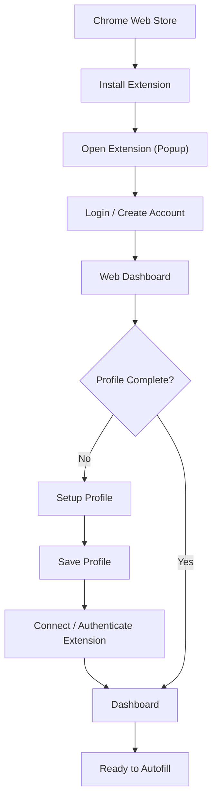
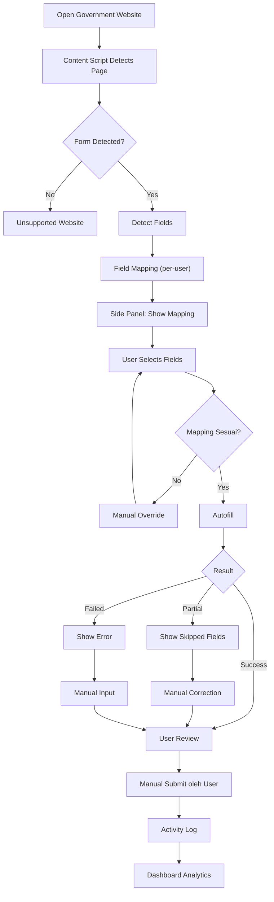

# GovConnect — User Flow (sesuai PRD v3.0)

## 1. Onboarding & Profile Setup

```mermaid
flowchart TD
    A[Chrome Web Store] --> B[Install Extension]
    B --> C["Open Extension (Popup)"]
    C --> D[Login / Create Account]
    D --> E[Web Dashboard]
    E --> F{Profile Complete?}
    F -->|No| G[Setup Profile]
    G --> H[Save Profile]
    H --> I[Connect / Authenticate Extension]
    I --> J[Dashboard]
    F -->|Yes| J
    J --> K[Ready to Autofill]
```

## 2. Autofill Flow

```mermaid
flowchart TD
    A[Open Government Website] --> B[Content Script Detects Page]
    B --> C{Form Detected?}
    C -->|No| D[Unsupported Website]
    C -->|Yes| E[Detect Fields]
    E --> F["Field Mapping (per-user)"]
    F --> G[Side Panel: Show Mapping]
    G --> H[User Selects Fields]
    H --> I{Mapping Sesuai?}
    I -->|No| J[Manual Override]
    J --> H
    I -->|Yes| K[Autofill]
    K --> L{Result}
    L -->|Success| M[User Review]
    L -->|Partial| N[Show Skipped Fields]
    N --> O[Manual Correction]
    O --> M
    L -->|Failed| P[Show Error]
    P --> Q[Manual Input]
    Q --> M
    M --> R[Manual Submit oleh User]
    R --> S[Activity Log]
    S --> T[Dashboard Analytics]
```